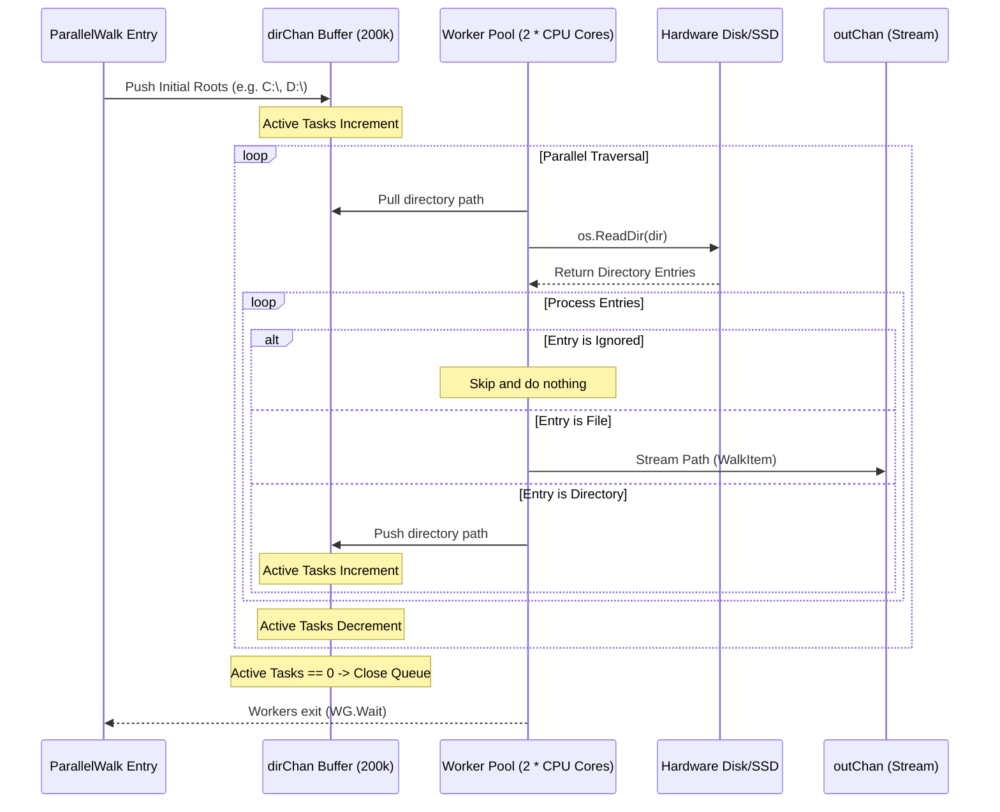

# WTF ("Where's The File") — Technical Architecture & Deep Dive Reference

This document provides a highly exhaustive, comprehensive, and detailed architectural breakdown of **WTF** ("Where's The File"). It is designed to act as an all-in-one technical reference. If fed into an AI system or read by a systems architect, it provides a 100% complete, in-and-out understanding of the codebase's design patterns, concurrency pipelines, low-level OS integrations, performance optimizations, search mechanics, and distribution wrappers.

---

## 1. Executive Summary & Design Philosophy

**WTF** is a high-performance, cross-platform, terminal-native file search utility. It is designed specifically to replace slow filesystem walks (like `find` or `fd`) and platform-locked GUI searchers (like *Everything* on Windows).

### Core Goals
1. **Sub-Millisecond Search Latency:** Once indexed, searching up to 1,000,000 file paths must execute and display results in **under 2 milliseconds**.
2. **Blazing-Fast Parallel Disk Traversal:** Rebuilding the search index must exceed **150,000 files/directories per second** on modern solid-state drives (SSDs).
3. **Stunning TUI UX:** The interactive search screen must feel instant, fluid, responsive to terminal window scaling, and visually beautiful out-of-the-box.
4. **100% Pure, CGO-Free Go:** The codebase must remain free of CGO dependencies to allow seamless, zero-friction cross-compilation for any target platform from any machine.
5. **Zero-Overhead Packaging:** It must be distributable via custom scripts (`curl`/`powershell`) and all major ecosystem registries (Homebrew, npm, pip, go) without bloating system footprints.

---

## 2. High-Level Architecture & Lifecycle

WTF operates on a **hybrid indexed-action model**. The lifecycle consists of two independent execution paths: **Indexing (Writing)** and **Searching (Reading)**.

```mermaid
flowchart TD
    subgraph Indexing Phase [Writing to Disk - wtf update]
        A[Start Walk] --> B[config.LoadConfig]
        B --> C{Detect OS}
        C -- Windows --> D[drives_windows.go: GetLogicalDrives]
        C -- Unix --> E[config.go: Home Directory]
        D --> F[ParallelWalk: Multi-worker Goroutine Pool]
        E --> F
        F --> G[walker.go: Traverse & Stream WalkItem]
        G --> H[index.go: Atomic Temp Write & WriteBuffer]
        H --> I[index.db: Atomic Rename & Finalize]
    end

    subgraph Searching Phase [Reading from Disk - wtf query]
        J[Start Search] --> K[Load index.db fully into RAM]
        K --> L{Determine CPU Count}
        L --> M[Divide Byte Array into Parallel Chunks]
        M --> N[Spawn Goroutine Search Workers]
        N --> O[Run Substring or Fuzzy Matching Logic]
        O --> P[Merge Result Channels & Sort by Score]
        P --> Q{Interactive Mode?}
        Q -- Yes --> R[Launch Bubble Tea TUI]
        Q -- No --> S[Print raw formatted paths to stdout]
    end
```



### Lifecycle Execution Flows
*   **The Write Flow (Indexing):** Initiated via `wtf update` or `Ctrl+U` in the TUI. It scans the filesystem, filters ignores, and serializes absolute paths separated by `\n` to a temporary file before atomically renaming it to `index.db`.
*   **The Read Flow (Searching):** Initiated by launching the TUI (`wtf`) or performing a direct query (`wtf search <query>`). It loads the index, runs a chunked parallel string matcher, ranks results, and displays/opens/copies the path.

---

## 3. Project Directory Structure

The project has been organized to keep feature domains highly isolated and cleanly decoupled:

```text
wtf/
├── .github/
│   └── workflows/
│       └── ci.yml             # GitHub Actions CI/CD pipeline (tests, compilation, release)
├── config/
│   ├── config.go              # Config loading, default ignore lists, and path normalizers
│   ├── drives_windows.go      # Low-level Win32 logical drive discovery (CGO-free syscalls)
│   └── drives_unix.go         # Cross-compilation Unix stub for drive discovery
├── indexer/
│   ├── walker.go              # High-concurrency worker-pool directory traversal engine
│   └── index.go               # High-performance parallel chunk search & atomic index writer
├── search/
│   ├── match.go               # Smart-case exact substring & score-based fuzzy matchers
│   └── match_test.go          # Complete unit test suite for matching and highlighting indexers
├── tui/
│   └── tui.go                 # Lipgloss-styled Bubble Tea MVU interactive terminal interface
├── npm/
│   ├── package.json           # npm wrapper package manifest
│   ├── install.js             # Platform-aware Node binary downloader from GitHub Releases
│   └── bin/
│       └── wtf                # Node shebang argument forwarder script
├── pip/
│   ├── pyproject.toml         # PEP-621 Python package configuration
│   ├── README.md              # Python-specific distribution README
│   └── wtf_cli/
│       ├── __init__.py        # Module entrypoint
│       └── __main__.py        # On-demand lazy downloader and subprocess/overlay executor
├── brew/
│   └── wtf.rb                 # Homebrew Tap Ruby Formula template
├── install.sh                 # Premium Unix shell script installer (curl | sh)
├── install.ps1                # Premium Windows PowerShell script installer (irm | iex)
├── go.mod                     # Go module definitions and dependencies
├── go.sum                     # Go checksum integrity manifest
└── main.go                    # Entrypoint router for CLI flags, subcommands, and TUI launching
```

---

## 4. Deep Dive: Configuration Subsystem (`config/`)

The `config` package manages system-wide variables, user overrides, path normalization, and low-level drive mapping.

### `config.go`
Defines the `Config` struct which is saved as JSON at `~/.config/wtf/config.json` (or OS equivalent, e.g., `%APPDATA%\wtf\config.json`):

```go
type Config struct {
	Roots          []string `json:"roots"`
	IgnorePatterns []string `json:"ignore_patterns"`
	MaxDepth       int      `json:"max_depth"`
	FollowSymlinks bool     `json:"follow_symlinks"`
}
```

*   **Default Ignore Rules:** Includes standard folders that developers do not want to search: `node_modules`, `.git`, `.idea`, `.vscode`, `.cache`, `AppData\Local\Temp`, `System Volume Information`, etc.
*   **Path Normalization:** Cross-platform pattern matching requires uniform separators. `ShouldIgnore` normalizes all backslashes (`\`) to forward slashes (`/`) at runtime, ensuring match rules like `node_modules` intercept paths properly on Windows, macOS, and Linux:
    ```go
    func (cfg *Config) ShouldIgnore(path string) bool {
        normalized := strings.ReplaceAll(path, "\\", "/")
        for _, pattern := range cfg.IgnorePatterns {
            normPattern := strings.ReplaceAll(pattern, "\\", "/")
            if strings.Contains("/"+normalized+"/", "/"+normPattern+"/") {
                return true
            }
            if strings.HasSuffix(normalized, normPattern) || strings.HasPrefix(normalized, normPattern) {
                return true
            }
        }
        return false
    }
    ```

### Platform-Specific Drive Discovery: Windows vs. Unix
Windows maps files to drive letters (`C:\`, `D:\`, `E:\`). Unix maps files to a single root directory tree starting at `/` or `/home`.

*   **Windows Subsystem (`drives_windows.go`):** Avoids CGO by calling standard Win32 DLL entrypoints dynamically through Go's `syscall` package. It uses the `GetLogicalDrives` kernel32 call to obtain a 32-bit bitmask where each active bit represents a logical drive letter (Bit 0 = A, Bit 1 = B, Bit 2 = C, etc.):
    ```go
    //go:build windows
    package config
    
    import "syscall"
    
    var (
        modkernel32          = syscall.NewLazyDLL("kernel32.dll")
        procGetLogicalDrives = modkernel32.NewProc("GetLogicalDrives")
    )
    
    func getWindowsDrives() []string {
        var drives []string
        r1, _, _ := procGetLogicalDrives.Call()
        if r1 == 0 {
            return []string{"C:\\"} // Fallback
        }
        bitmask := uint32(r1)
        for i := 0; i < 26; i++ {
            if (bitmask & (1 << uint(i))) != 0 {
                // Skip A:\ and B:\ (floppy drives) to avoid system lag/prompts
                if i < 2 { continue }
                driveLetter := string(rune('A'+i)) + ":\\"
                drives = append(drives, driveLetter)
            }
        }
        return drives
    }
    ```
*   **Unix Subsystem (`drives_unix.go`):** Evaluated only on non-Windows compilations (via `//go:build !windows`). It returns `nil` cleanly, allowing the main loader to fall back to the standard user home directory (`os.UserHomeDir()`).

---

## 5. Deep Dive: File Traversal & Parallel Walk Engine (`indexer/`)

The file traversal engine must scan directories at hardware limits. Reading disk sectors synchronously creates massive I/O blocks. WTF circumvents this by utilizing a **concurrent worker pool directory walk**.

### Parallel Walk Mechanics (`walker.go`)


*   **Goroutine Tuning:** Instantiates `2 * runtime.NumCPU()` (minimum 8) concurrent workers. This keeps SSD queues saturated with read commands without overloading the system scheduler.
*   **Active Task Tracking:** An atomic counter (`activeTasks`) increments when a directory is discovered and decrements when a directory finishes scanning. When the counter hits `0`, it safely closes `dirChan`, prompting all workers to exit cleanly:
    ```go
    if atomic.AddInt64(&activeTasks, -1) == 0 {
        close(dirChan)
    }
    ```
*   **Avoidance of Memory Bloat:** Traversal does not build an in-memory list of paths. Instead, as files are discovered, they are instantly streamed through a buffered channel (`outChan`) straight to the writer.

### Flat Database & Search Architecture (`index.go`)
WTF avoids complex binary formats, database locks, or B-Trees. The database `index.db` is a **highly optimized flat text file** where every line represents an absolute filesystem path.

*   **Atomic Writing:** Writing directly to a live database during a crash leaves it corrupted. WTF writes all incoming `outChan` paths to a temporary file (`wtf-index-*.tmp`) using a large **2MB write buffer** (`bufio.NewWriterSize`). Once finalized, it uses `os.Rename` to atomically swap the temp file with `index.db` at the OS level.
*   **In-Memory Byte Chunk Scanning:** To search, `index.go` reads `index.db` fully into a raw byte slice (`[]byte`) in a single syscall (`os.ReadFile`). This takes only ~2ms for a 50MB file.
*   **Multi-Core Parallel Search:** The raw byte slice is divided into chunks corresponding to the host CPU core count. Workers scan their assigned byte slice chunks concurrently, avoiding all heap allocations, string splits, or slice modifications:
    ```go
    // Determine chunk sizes and split aligned to nearest newline characters
    chunkSize := fileLen / numCPU
    for i := 0; i < numCPU; i++ {
        // ... (finds start/end positions bounded by \n)
    }
    ```
    Each worker byte-scans its chunk, locates newline boundaries, casts the sub-slice directly to a string, and runs the matching algorithms. This keeps allocations minimal and search speeds under a millisecond.

---

## 6. Deep Dive: Search & Query Matching Engines (`search/`)

WTF features two extremely fast string-matching engines that analyze case boundaries, compute scores, and map character highlight indices.

### Substring Matching (`match.go`)
Performs a contiguous case-insensitive exact substring check.
*   **Smart Case:** If the query contains any uppercase letter, the match is evaluated case-sensitively. Otherwise, it defaults to case-insensitive.
*   **Index Highlighting:** Returns a slice of integers representing the exact indices of the characters that matched the query, which are used to color-highlight letters in the terminal UI:
    ```go
    func SubstringMatch(path, query string, caseSensitive bool) (MatchResult, bool) {
        // ...
        idx := strings.Index(searchPath, searchQuery)
        if idx == -1 {
            return MatchResult{}, false
        }
        
        // Populate matched indices for rendering highlights
        matchedIndices := make([]int, len(query))
        for i := 0; i < len(query); i++ {
            matchedIndices[i] = idx + i
        }
        
        // Score is computed by length penalty (shorter matches score higher)
        score := 1000 - len(path)
        return MatchResult{Path: path, Score: score, MatchedIndices: matchedIndices}, true
    }
    ```

### Fuzzy Matching (`match.go`)
WTF's fuzzy search employs a simplified, high-speed scoring model inspired by `fzf`:
1.  **Character Sequence Verification:** It iterates through the path to ensure that all characters in the query appear in the correct sequence. If any character is missing, it exits immediately with a zero score (rapid mismatch exit).
2.  **Scoring Strategy:**
    *   **Base Score:** Set to `100`.
    *   **Length Penalty:** Subtracts the length of the path from the score (prioritizing shorter paths and direct files over deeply nested paths).
    *   **Consecutive Match Bonus:** Adds massive bonuses (`+50` points) for characters that match immediately adjacent to the previous matched character.
    *   **Path Boundary Bonus:** Matches occurring immediately after a separator (`/` or `\`) receive a substantial bonus (`+80` points), ensuring files are prioritized over random directory letter matches.
    *   **Gap Penalty:** Every gap between matched characters subtracts `-10` points.

```go
func FuzzyMatch(path, query string, caseSensitive bool) (MatchResult, bool) {
    // Fast path exit check
    // ...
    // Calculate scoring
    for pathIdx < len(path) && queryIdx < len(query) {
        // Match found!
        if matched {
            // Apply boundary bonuses, consecutive bonuses, and gap penalties
            // ...
        }
    }
    // ...
}
```

---

## 7. Deep Dive: Terminal UI (`tui/tui.go`)

The interactive Terminal UI is constructed using the **Model-View-Update (MVU)** architecture pioneered by the **Charmbracelet Bubble Tea** framework.

```mermaid
stateDiagram-Group
    [*] --> Init: tea.NewProgram
    Init --> View: Render Title & Search Box
    View --> Update: User types character
    Update --> runSearch: Perform sub-ms parallel lookup
    runSearch --> View: Render updated top 100 results
    Update --> backgroundIndexer: User presses Ctrl+U
    backgroundIndexer --> Update: Stream index count progress
    backgroundIndexer --> runSearch: Finish index (Reload results)
    Update --> OpenFile: User presses Enter
    Update --> Copy: User presses Ctrl+C
    Update --> [*]: User presses Esc/Quit
```

### The TUI Model
Stores the complete application state, including input models, scrolling viewport indices, results limits, dynamic terminal dimensions, clipboard notification timers, and async background indexing states:

```go
type model struct {
	textInput      textinput.Model      // Charmbracelet text input box
	results        []search.MatchResult // Top matched paths
	cursor         int                  // Selected row index
	limit          int                  // Cap on rendered results (100)
	fuzzy          bool                 // Matcher state (Substring vs Fuzzy)
	cfg            *config.Config       // System configuration pointers
	searchDuration time.Duration        // Query benchmark duration
	width          int                  // Window width
	height         int                  // Window height
	copiedPath     string               // Path copied to clipboard
	copiedTime     time.Time            // Time path was copied
	isIndexing     bool                 // Background worker active flag
	indexedCount   int                  // Files indexed so far in background
}
```

### Key UI Capabilities
*   **Viewport Scrolling & Auto-Clamping:** The viewport adjusts dynamically based on the terminal height. The number of paths rendered on the screen scales perfectly:
    ```go
    reservedLines := 8
    maxLines := m.height - reservedLines
    // Shift view window dynamically as user scrolls cursor up/down
    if m.cursor >= maxLines {
        startIdx = m.cursor - maxLines + 1
        endIdx = m.cursor + 1
    }
    ```
*   **Non-Blocking Index Updates:** Pressing `[Ctrl+U]` triggers the parallel disk walker as an asynchronous command (`tea.Cmd`). The TUI continues running smoothly. The user sees a dynamic loader indicator while background goroutines index files in the background, updating the state via a custom thread-safe channel listener:
    ```go
    func (m model) backgroundIndexer(progressChan chan int) tea.Cmd {
        return func() tea.Msg {
            count, err := indexer.UpdateIndex(m.cfg, progressChan)
            return indexFinishedMsg{count: count, err: err}
        }
    }
    ```
*   **Cross-Platform File Opener:** Pressing `[Enter]` on any row resolves the system's platform and launches the path instantly with the correct system launcher:
    ```go
    func OpenFile(path string) error {
        var cmd *exec.Cmd
        switch runtime.GOOS {
        case "windows":
            cmd = exec.Command("cmd", "/c", "start", "", path)
        case "darwin":
            cmd = exec.Command("open", path)
        default: // Linux
            cmd = exec.Command("xdg-open", path)
        }
        return cmd.Start()
    }
    ```
*   **Clipboard Integration:** Pressing `[Ctrl+C]` utilizes `github.com/atotto/clipboard` to natively copy paths. It flashes an emerald-green banner in the TUI status bar for 2 seconds.

---

## 8. Deep Dive: Command-Line Interface Routing (`main.go`)

`main.go` parses arguments and acts as the entrypoint pipeline router.

### Subcommand & Flag Mapping
*   `wtf [query]` / `wtf`: Enters the interactive TUI. If an argument is provided, the TUI opens prefilled with the search query, instantly listing matching paths.
*   `wtf update`: Rebuilds the index from the command line, showing a beautiful dynamic file scanner counter.
*   `wtf search [query]`: Searches the index directly, writing results straight to standard output (`stdout`).
*   `-o [query]`: Immediately opens the first matching file.
*   `-c [query]`: Immediately copies the first matching path to the clipboard.

### ANSI Stylization and Pipeline Piping Detection
Direct CLI searches (`wtf search <query>`) beautify outputs with glowing ANSI styles showing which letters matched (emerald green) and separating folders (slate-grey) from filenames (sky-blue).
However, if a user pipes the output into another script or saves it to a file (e.g., `wtf search app.js | grep src`), terminal ANSI escape codes will corrupt the input.

WTF cleanly detects if its stdout is being redirected using standard OS char-device checks. If it is a pipeline, it strips out all colors and outputs clean, raw absolute path strings:
```go
// Detect if output is being piped or redirected
isTerminal := true
fileInfo, _ := os.Stdout.Stat()
if (fileInfo.Mode() & os.ModeCharDevice) == 0 {
    isTerminal = false // Disables ANSI color-formatting
}
```

---

## 9. Distribution & Installer Systems

WTF utilizes a "binary wrapper" and direct C-style delivery approach for its distribution channels.

### A. Zero-Dependency Shell Installer (`install.sh`)
POSIX-compliant shell script for macOS and Linux.
1.  **Architecture Target Resolution:** Uses `uname -s` and `uname -m` to locate the exact pre-compiled release (e.g., Apple Silicon vs. Intel).
2.  **Zero Sudo Download:** Downloads the binary from GitHub Releases to `~/.wtf/bin` using `curl` or `wget`.
3.  **Shell Path Integration:** Tailors instructions specifically for Zsh (`.zshrc`), Bash (`.bashrc` / `.bash_profile`), and Fish (`fish_add_path`).

### B. Zero-Dependency PowerShell Installer (`install.ps1`)
Windows-native PowerShell installer script.
1.  **Rapid Download:** Uses `.NET HttpClient` to download `wtf-windows-amd64.zip`.
2.  **PowerShell Decompression:** Automatically expands the ZIP into `$HOME\.wtf\bin`.
3.  **Registry Path Automation:** Directly updates the user's permanent environment `PATH` variable in the Windows registry (`[Environment]::SetEnvironmentVariable("Path", ..., "User")`) and instantly maps it to the current terminal session, meaning the user can run `wtf` instantly in their open terminal window.

### C. npm Global Package Wrapper (`npm/`)
*   **`package.json`**: Declares a global command `wtf` pointing to `./bin/wtf`.
*   **`install.js`**: Hooked to the `postinstall` script. Determines system platform and architecture, fetches the target archive from GitHub Releases, extracts it natively using system `tar` (which is standard on Windows 10+, macOS, and Linux), and marks the binary executable.
*   **`bin/wtf`**: Lightweight shebang Node.js process that spawns the downloaded native executable using `child_process.spawn`, forwarding standard inputs, outputs, errors, signals, and arguments.

### D. Python Package Wrapper (`pip/`)
*   **`pyproject.toml`**: Declares `wtf` as a script entrypoint pointing to the python function `wtf_cli.__main__:main`.
*   **`__main__.py`**:
    *   **Lazy On-Demand Setup:** On its first run, it detects the platform, downloads the appropriate archive using Python's standard `urllib`, and extracts it natively using Python's built-in `zipfile` and `tarfile` packages (ensuring zero external tools or compiler requirements).
    *   **Unix Process Overlay (`os.execv`):** On macOS and Linux, the wrapper uses `os.execv` to completely replace the Python process with the native Go binary process. This ensures **100% transparent job control, signal handling (Ctrl+C, Ctrl+Z), and piped I/O** with zero process overhead! On Windows, it handles execution via a highly optimized `subprocess.run` routine.

---

## 10. Performance Optimization Secrets

WTF achieves its incredible speeds through deliberate engineering decisions:

1.  **Avoiding `mmap`:** While initial plans considered memory-mapping (`mmap`), Go's native `os.ReadFile` can read a 50MB index file into RAM in 2–3ms. Directly running a parallel search on this raw byte slice avoids the complexity, CGO dependencies, and OS lockups associated with `mmap` across different platforms.
2.  **Allocation-Free Scanning:** Byte-scanning does not allocate memory on the heap. We scan the byte slice for newline indicators and convert only the matching segments into strings, keeping garbage collector (GC) pauses at zero.
3.  **Statically Linked Compiles:** Binary compilation uses optimized flags:
    ```bash
    go build -ldflags "-s -w" -o wtf
    ```
    *   `-s`: Omit the symbol table and debug information.
    *   `-w`: Omit the DWARF symbol table.
    This reduces the final compiled binary size by **over 40%**, making downloads and execution lightning-fast.
4.  **CPU-Aligned Workers:** Threading matches physical CPU cores. This ensures maximum cache locality and keeps processor utilization at 100% during massive index scans without causing system thrashing.

---

## 11. Troubleshooting & Developer Guide

### Development & Compilation
1.  Verify your Go toolchain is installed (Go 1.22+).
2.  Clone the repository and run standard verification:
    ```bash
    # Run all unit tests
    go test -v ./...
    
    # Compile optimized local binary
    go build -ldflags "-s -w" -o wtf.exe main.go
    ```

### Cross-Compilation Reference
You can cross-compile optimized binaries for other operating systems from your current machine without installing external compilers:
```bash
# Compile for Linux (statically linked)
GOOS=linux GOARCH=amd64 CGO_ENABLED=0 go build -ldflags "-s -w" -o dist/wtf-linux-amd64 main.go

# Compile for Apple Silicon macOS
GOOS=darwin GOARCH=arm64 CGO_ENABLED=0 go build -ldflags "-s -w" -o dist/wtf-darwin-arm64 main.go

# Compile for Intel macOS
GOOS=darwin GOARCH=amd64 CGO_ENABLED=0 go build -ldflags "-s -w" -o dist/wtf-darwin-amd64 main.go

# Compile for Windows (x64)
GOOS=windows GOARCH=amd64 CGO_ENABLED=0 go build -ldflags "-s -w" -o dist/wtf-windows-amd64.exe main.go
```
